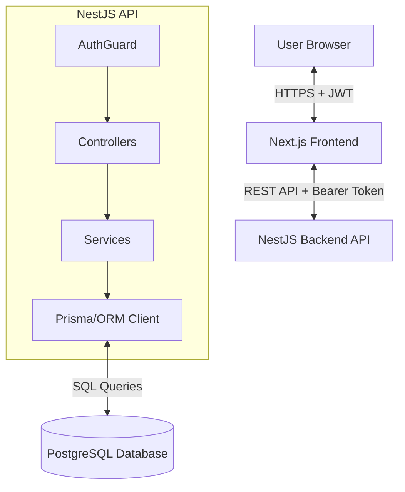
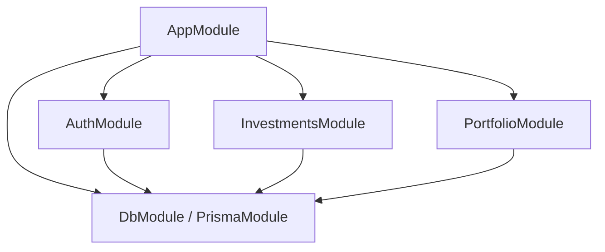
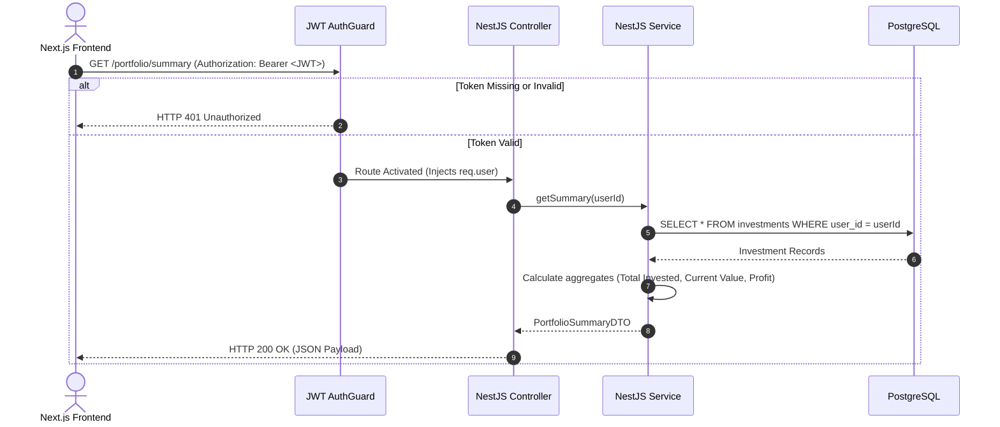

# System Architecture

This document describes the structural design, module boundaries, database interactions, and request lifecycle of the FinVestia system.

---

## 1. High-Level Architecture

FinVestia is built using a decoupled client-server architecture. The frontend is a Next.js application, and the backend is a NestJS REST API. Both layers interact with a PostgreSQL database.



---

## 2. Module Boundaries (Backend)

The NestJS backend is split into logical modules to maintain low coupling and high cohesion.



### Module Responsibilities
1. **AppModule**: The entry point module that binds global configuration, routes, database modules, and global exceptions.
2. **AuthModule**: Handles user registration, credentials verification, password hashing, and signing JWT access tokens.
3. **InvestmentsModule**: Manages the CRUD endpoints for holdings. Enforces validation guards to prevent cross-tenant modifications.
4. **PortfolioModule**: Fetches investments for the active user and performs aggregation calculations to supply dashboard summary statistics.
5. **DbModule**: Encapsulates the ORM connection client and lifecycle management, providing database accessibility across services.

---

## 3. Request Lifecycle

The diagram below maps a request from the Next.js frontend to the NestJS backend and back.



---

## 4. Tenant Isolation & Database Interaction

Data security is enforced at the service query level. Rather than relying on frontend-supplied owner identifiers, the backend strictly resolves user context from the verified JWT payload.

```text
               [ Decoded JWT Payload ]
                         │
                         ▼
             req.user = { id: "user_uuid_123" }
                         │
                         ▼
        [ Service Query Filter Enforced ]
SELECT * FROM investments WHERE user_id = req.user.id AND id = :id
```

### Database Isolation Rules
- **No Shared Keys**: The frontend does not pass a `user_id` query parameter or body parameter to create, read, update, or delete investments. The user ID is retrieved directly from the verified request context parsed from the JWT.
- **Resource Scope Validation**: For `GET /investments/:id`, `PUT /investments/:id`, and `DELETE /investments/:id`, the query matches both the investment UUID and the user UUID. If the investment exists but does not belong to the user, the database query returns null, causing the API to respond with a 404 (Not Found) or 403 (Forbidden) to prevent scanning assets.
