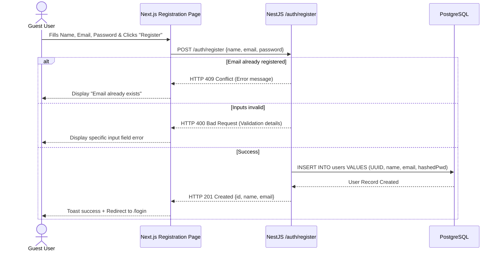
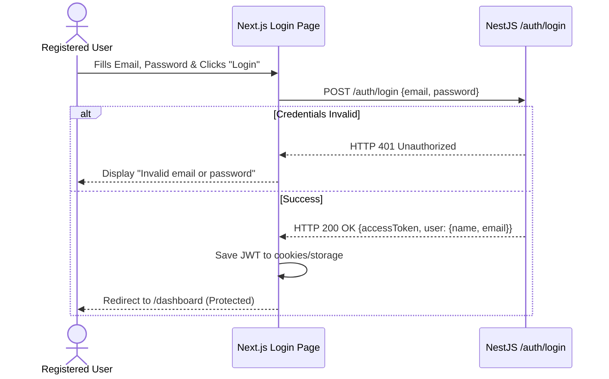
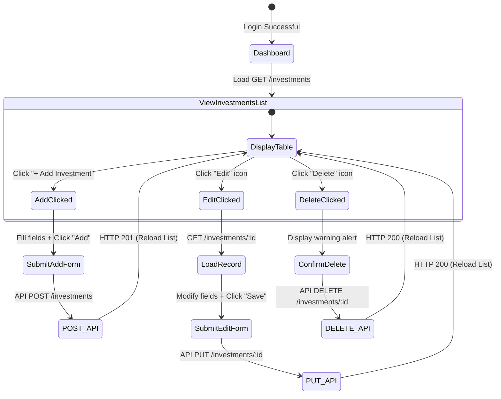
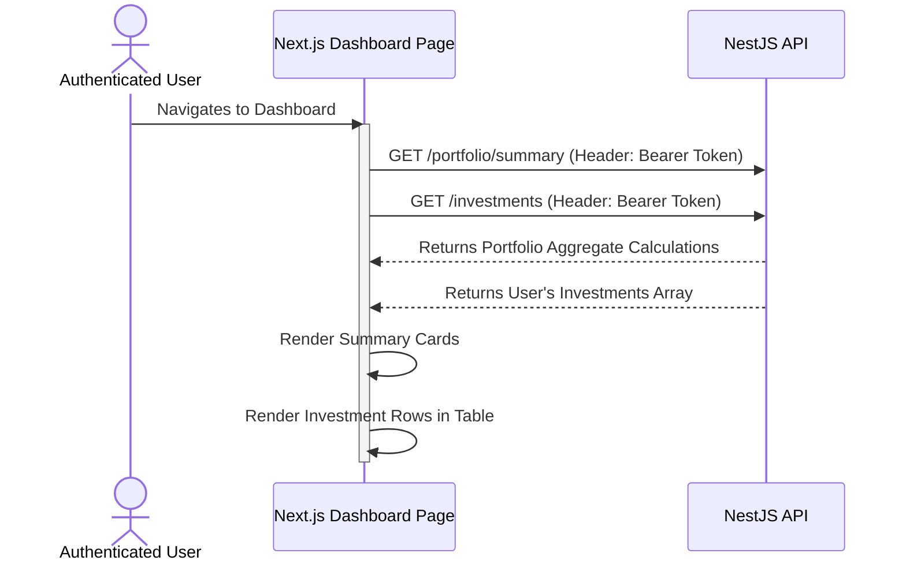

# User Workflow

This document details the navigation, form submissions, and data transitions a user experiences within the FinVestia application.

---

## 1. Authentication Workflows

### 1.1 User Registration Flow
Guest users create an account by submitting credentials. Upon success, they are redirected to the Login screen.

### 1.2 User Login Flow
Registered users enter credentials to receive a JWT session. Upon successful validation, they are logged in and routed to the dashboard.

---

## 2. Investment CRUD Operations Workflow

Authenticated users can manage their holdings using forms that interact with the protected `/investments` endpoints.

---

## 3. Portfolio Summary Refresh Workflow

The dashboard summary statistics are fetched in parallel with the list of investments.

