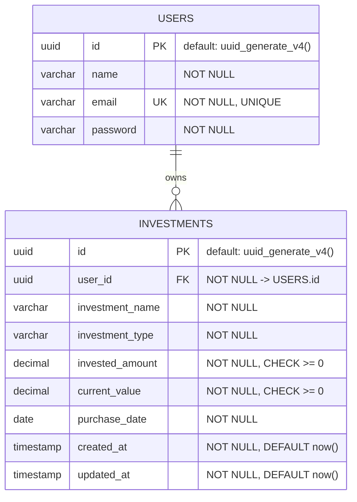

# Database Schema Specification

This document defines the PostgreSQL physical database model, constraints, indexes, and migrations workflow for FinVestia.

---

## 1. Entity Relationship (ER) Diagram



---

## 2. Table Definitions

### 2.1 `users` Table
Stores user registration profiles and hashed passwords.

```sql
CREATE TABLE users (
    id UUID PRIMARY KEY DEFAULT gen_random_uuid(),
    name VARCHAR(100) NOT NULL,
    email VARCHAR(255) NOT NULL UNIQUE,
    password VARCHAR(255) NOT NULL
);
```

#### Fields Description
- `id`: Unique user identifier (UUID).
- `name`: The display name of the registered user (supports unicode characters).
- `email`: Normalized, lowercase email. Checked for uniqueness.
- `password`: Hashed string (typically 60 characters for Bcrypt).

### 2.2 `investments` Table
Stores investment details mapped to their owning user.

```sql
CREATE TABLE investments (
    id UUID PRIMARY KEY DEFAULT gen_random_uuid(),
    user_id UUID NOT NULL,
    investment_name VARCHAR(255) NOT NULL,
    investment_type VARCHAR(100) NOT NULL,
    invested_amount DECIMAL(15, 2) NOT NULL,
    current_value DECIMAL(15, 2) NOT NULL,
    purchase_date DATE NOT NULL,
    created_at TIMESTAMP NOT NULL DEFAULT CURRENT_TIMESTAMP,
    updated_at TIMESTAMP NOT NULL DEFAULT CURRENT_TIMESTAMP,
    
    -- Constraints
    CONSTRAINT fk_user FOREIGN KEY (user_id) REFERENCES users(id) ON DELETE CASCADE,
    CONSTRAINT check_invested_amount_non_negative CHECK (invested_amount >= 0.00),
    CONSTRAINT check_current_value_non_negative CHECK (current_value >= 0.00)
);
```

#### Fields Description
- `id`: Unique investment record identifier (UUID).
- `user_id`: Links the investment to its owning user. Cascades deletes on user deletion.
- `investment_name`: Free-text identifier for the asset (e.g., "Mutual Fund A").
- `investment_type`: Categorization of holding (e.g., "Stock", "Mutual Fund", "Crypto").
- `invested_amount`: Decimal representation of capital invested. Checked to ensure it cannot be negative.
- `current_value`: Decimal representation of current valuation. Checked to ensure it cannot be negative.
- `purchase_date`: Calendar date the investment was bought.

---

## 3. Indexes & Constraints

To optimize retrieval speeds and guarantee referential boundaries, the following configurations are defined:

1. **Unique Index on `users.email`**:
   - Automatically created by the `UNIQUE` constraint. Ensures fast lookup during authentication.
2. **Foreign Key Index on `investments.user_id`**:
   - Because all investments are queried by user ID (for list viewing and dashboard summaries), a composite or single index on `user_id` is required:
   ```sql
   CREATE INDEX idx_investments_user_id ON investments(user_id);
   ```
3. **Index on `investments.purchase_date`**:
   - Speeds up default sorting behavior when displaying investments chronologically.
   ```sql
   CREATE INDEX idx_investments_purchase_date ON investments(purchase_date DESC);
   ```

---

## 4. Migrations Workflow (Using Prisma)

Prisma will be used to manage migrations. The Prisma schema (`schema.prisma`) represents these entities as models:

```prisma
model User {
  id          String       @id @default(uuid())
  name        String
  email       String       @unique
  password    String
  investments Investment[]

  @@map("users")
}

model Investment {
  id             String   @id @default(uuid())
  userId         String   @map("user_id")
  investmentName String   @map("investment_name")
  investmentType String   @map("investment_type")
  investedAmount Float    @map("invested_amount") // stored as decimal/double precision
  currentValue   Float    @map("current_value")
  purchaseDate   DateTime @map("purchase_date")
  createdAt      DateTime @default(now()) @map("created_at")
  updatedAt      DateTime @updatedAt @map("updated_at")

  user User @relation(fields: [userId], references: [id], onDelete: Cascade)

  @@index([userId])
  @@map("investments")
}
```

*Note: In Prisma schema maps and indexes are handled natively, resulting in equivalent SQL migrations matching the PostgreSQL specifications.*
